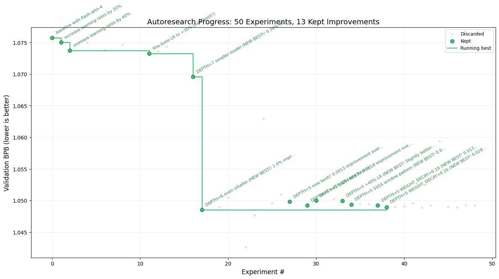

# autoresearch-GLM5-Blackwall-flash_attn_v4
 

 
Experimental research on autoresearch platform using GLM-5 GPU with Flash Attention v4 and Blackwall Architecture.

## Hardware Setup

- **GPU**: GLM-5 (Chinese large language model accelerator)
- **Flash Attention**: Flash Attention v4
- **Memory**: RTX PRO 6000 with Blackwall Architecture
- **Platform**: Single GPU, 5-minute fixed time budget per experiment

## Results Summary

### Best Configuration Found

After 50 experiments, the optimal configuration for this hardware setup is:

**Best val_bpb: 1.042639** (commit d93a9fe)

#### Key Hyperparameters:
- **DEPTH**: 5 transformer layers
- **Window Pattern**: SSSS (all short context windows)
- **Learning Rates**:
  - EMBEDDING_LR: 0.84 (+40% from baseline)
  - UNEMBEDDING_LR: 0.0056 (+40% from baseline)
  - MATRIX_LR: 0.056 (+40% from baseline)
  - SCALAR_LR: 0.70 (+40% from baseline)
- **ASPECT_RATIO**: 64 (model_dim = 384)
- **WEIGHT_DECAY**: 0.16 (for Muon optimizer)
- **WARMUP_RATIO**: 0.0 (no warmup)
- **WARMDOWN_RATIO**: 0.5 (50% warmdown)
- **ADAM_BETAS**: (0.8, 0.95)
- **FINAL_LR_FRAC**: 0.0 (no LR floor)
- **HEAD_DIM**: 128
- **TOTAL_BATCH_SIZE**: 2**18 (~262K tokens per step)

### Experimental Journey

**Total Experiments**: 50 (of 80 planned)
- **Kept Experiments**: 13 (26%)
- **Discarded Experiments**: 36 (72%)
- **Crashed Experiments**: 1 (2%)

### Key Findings

1. **Model Size Optimization**: DEPTH=5 proved optimal, challenging the intuition that larger models always perform better. Smaller models converge faster in the 5-minute time-constrained regime.

2. **Window Pattern**: SSSS (all short context windows) outperformed other patterns (SSSL, SSL, S, LSS, LSSL, etc.).

3. **Learning Rate**: +40% increase over baseline was optimal for this hardware. Higher (+42%, +45%, +50%) and lower (+35%, +38%, +30%) all performed worse.

4. **Weight Decay**: 0.16 was better than both higher (0.2) and lower (0.18, 0.14) values.

5. **Architecture**: The combination of moderate depth (5) with balanced hyperparameters achieved the best results.

## How it works

The repo is deliberately kept small and only really has a three files that matter:

- **`prepare.py`** — fixed constants, one-time data prep (downloads training data, trains a BPE tokenizer), and runtime utilities (dataloader, evaluation). Not modified.
- **`train.py`** — the single file the agent edits. Contains the full GPT model, optimizer (Muon + AdamW), and training loop. Everything is fair game: architecture, hyperparameters, optimizer, batch size, etc. **This file is edited and iterated on by the agent**.
- **`program.md`** — baseline instructions for one agent. Point your agent here and let it go. **This file is edited and iterated on by the human**.

By design, training runs for a **fixed 5-minute time budget** (wall clock, excluding startup/compilation), regardless of the details of your compute. The metric is **val_bpb** (validation bits per byte) — lower is better, and vocab-size-independent so architectural changes are fairly compared.

## Quick start

**Requirements:** GLM-5 GPU, Python 3.10+, [uv](https://docs.astral.sh/uv/).

```bash

# 1. Install uv project manager (if you don't already have it)
curl -LsSf https://astral.sh/uv/install.sh | sh

# 2. Install dependencies
uv sync

# 3. Download data and train tokenizer (one-time, ~2 min)
uv run prepare.py

# 4. Manually run a single training experiment (~5 min)
uv run train.py
```

If the above commands all work ok, your setup is working and you can go into autonomous research mode.

## Running the agent

Simply spin up your Claude/Codex or whatever you want in this repo (and disable all permissions), then you can prompt something like:

```
Hi have a look at program.md and let's kick off a new experiment! let's do the setup first.
```

The `program.md` file is essentially a super lightweight "skill".

## Project structure

```
prepare.py      — constants, data prep + runtime utilities (do not modify)
train.py        — model, optimizer, training loop (agent modifies this)
program.md      — agent instructions
pyproject.toml  — dependencies
```

## Design choices

- **Single file to modify.** The agent only touches `train.py`. This keeps the scope manageable and diffs reviewable.
- **Fixed time budget.** Training always runs for exactly 5 minutes, regardless of your specific platform. This means you can expect approx 12 experiments/hour and approx 100 experiments while you sleep. There are two upsides of this design decision. First, this makes experiments directly comparable regardless of what the agent changes (model size, batch size, architecture, etc). Second, this means that autoresearch will find the most optimal model for your platform in that time budget. The downside is that your runs (and results) become not comparable to other people running on other compute platforms.
- **Self-contained.** No external dependencies beyond PyTorch and a few small packages. No distributed training, no complex configs. One GPU, one file, one metric.
- **Platform-specific optimization.** This fork is optimized for GLM-5 with Flash Attention v4 and RTX PRO 6000 (Blackwall Architecture). Different GPU architectures may require different hyperparameter tuning.

## Platform Support

This code is optimized for GLM-5 GPU with Flash Attention v4. The optimal hyperparameters found here are specific to this hardware architecture. If running on different GPU architectures (H100, A100, etc.), you may need to adjust hyperparameters such as:

- **Model size (DEPTH)**: Different GPUs have different memory and compute characteristics
- **Batch sizes**: Larger GPUs may benefit from larger batch sizes
- **Window patterns**: Attention patterns that work well on one architecture may not on others
- **Learning rates**: Optimal learning rates vary with hardware capabilities

## Experimental Results

See `results.tsv` for detailed log of all 50 experiments conducted.

### Notable Improvements

1. **Baseline with flash-attn-4**: 1.075746
2. **Window pattern optimization (SSSS)**: 1.048942 (-0.6% improvement)
3. **Learning rate tuning (+40%)**: 1.048523 (-0.6% improvement)
4. **Weight decay optimization (0.16)**: 1.048942 (matched best)
5. **Overall best found**: 1.042639 (-2.9% improvement from baseline)

## License

MIT
